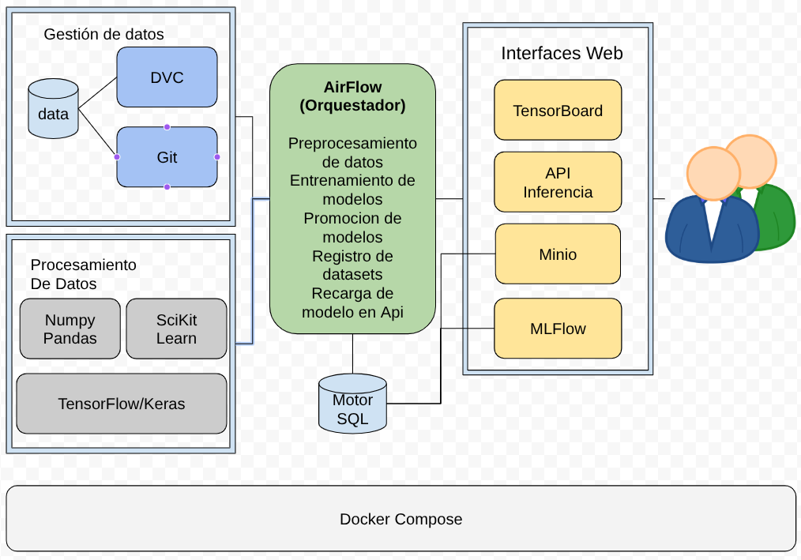

<p align="center">
  
</p>

<h1 align="center">Prueba Técnica - Mercado Libre  (Senior Machine Learning Engineer - IT Credits)</h1>


## 📌 Descripción  
Este proyecto implementa un pipeline de Machine Learning para el ecosistema Mercado Libre (MELI).  
Incluye: ingesta de datos, versionado de datos con DVC, orquestación con Apache Airflow, experimentación con MLflow, y despliegue de modelo con Flask + Gunicorn + nginx.  
Se apoya en un stack moderno: contenedores Docker/Docker Compose, almacenamiento de objetos MinIO, y herramientas de ciencia de datos como scikit‑learn, NumPy, Pandas y Keras/TensorFlow.

## 🧭 Arquitectura general  
1. **Extracción/Limpieza de datos**: scripts para preparar datos desde fuentes MELI.  
2. **Versionado de datos**: DVC trackea datasets y los empuja a un remoto MinIO/S3.  
3. **Orquestación de flujo de trabajo**: Airflow define DAGs que ejecutan preparación, entrenamiento, evaluación, registro de modelos y despliegue.  
4. **Entrenamiento/Experimentación**: MLflow captura parámetros, métricas, artefactos, datasets versionados y modelo final.  
5. **Despliegue**: Flask expone una API para inferencia, Gunicorn sirve la app, nginx actúa como proxy inverso.  
6. **Infraestructura como contenedor**: Docker Compose facilita el entorno local; en producción puede escalar a Swarm o Kubernetes.

## 🛠️ Requisitos  
- Docker ≥ 20.x  
- Docker Compose ≥ 2.x  
- Python ≥ 3.10  
- Git ≥ 2.x

## 🚀 Despliegue local
1. Clonar el repositorio  
```
git clone https://github.com/omazapa/ml_meli.git
cd ml_meli
```
2. Configurar variables de entorno  
```
.env
```
3. Construir y levantar los contenedores  
```
docker-compose up --build -d
```

---

## Acceder a las aplicaciones web
- Airflow: http://localhost:8080  
  user: admin  
  pass: mercadolibre
- MLflow: http://localhost:5000  
  user: admin  
  pass: mercadolibre
- TensorBoard: http://localhost:8090  
  user: admin  
  pass: mercadolibre
- MinIO: http://localhost:9000  
  user: minio  
  pass: mercadolibre
- MLflow API endpoint: http://localhost:8000  
  API Key: mercadolibre

## 📂 Estructura de carpetas
```
├── dags/                 # DAGs de Airflow
├── data/                 # Datos crudos / procesados (versionados con DVC)
├── etc/                  # Configuraciones varias
├── deps/                 # Archivos de dependencias (requirements.txt, etc)
├── mlflow_api/           # Código con la API de inferencia Flask
├── docker-compose.yml    # Definición del stack de contenedores
└── README.md
```
## 🧭 Diagrama de Arquitectura MLOps



## 🧰 Tech Stack Usada
* Docker y Docker Compose para la contenedorización y orquestación de servicios.
* Apache Airflow para la orquestación de flujos de trabajo de datos.
* MLflow para la gestión del ciclo de vida de los modelos de machine learning.
* TensorBoard para la visualización de métricas y gráficos de entrenamiento de modelos.
* MinIO como almacenamiento de objetos compatible con S3.
* DVC (Data Version Control) para el versionado y gestión de datos.
* Flask para la creación de APIs REST.
* Scikit-learn, Numpy y Pandas para el procesamiento y análisis de datos.
* Keras y TensorFlow para el desarrollo y entrenamiento de modelos de machine learning.
* Gunicorn como servidor WSGI para desplegar la aplicación Flask.
* nginx como servidor web y proxy inverso para manejar las solicitudes HTTP.
* htpasswd para gestionar las credenciales de autenticación básica en tensorboard.
* Python como lenguaje de programación principal.
* Git para el control de versiones del código fuente.
* Bash para la automatización de tareas y scripts.
* MySQL/PosgreSQL como sistema de gestión de bases de datos relacionales.
* GNU/Linux como sistema operativo base para los contenedores Docker.


## 🚀 Posibles Mejoras

* De momento la escalabilidad es vertical, se podría implementar escalabilidad horizontal con varios workers de airflow y mlflow.
* El endpoint en flask soporta solo un modelo, se podría mejorar para para múltiples modelos o tener un sistema de microsrervicios por modelo.
* Implementar pruebas unitarias y de integración. tests que verifiquen el correcto funcionamiento de los componentes del sistema.
* Implementar un sistema de monitoreo y alertas para los servicios desplegados.
* Mejorar la seguridad de las credenciales y secretos, utilizando un gestor de secretos.
* Implementar un sistema de logging centralizado para facilitar la depuración y el análisis de problemas
* Implementar soporte para certificados SSL/TLS para asegurar las comunicaciones entre los servicios y usar https.
* Implementar un sistema de backup y recuperación de datos para los modelos y datasets almacenados en MinIO y DVC.
* Implementar load balancing para distribuir la carga entre múltiples instancias de los servicios.
* Implementar un sistema de autenticación y autorización más robusto, como OAuth2 o JWT.
* De momento dvc funciona con un repositorio git local, se podría mejorar usando un repositorio remoto(ej:GitHub ).
* Implementar assets de airflow para gestionar los datasets y modelos de manera más eficiente.
* El sistema de log del endpoint flask es básico(guardo en un archivo), se podría con Prometheus/Grafana y con sentry.

## Seguridad y autenticación
* Airflow y MLflow tienen autenticación básica habilitada. Las credenciales están definidas en el archivo `.env`.
* La API de inferencia Flask utiliza autenticación basada en API Key. La clave API se define en el archivo `.env` y debe incluirse en el encabezado `X-API-KEY` de las solicitudes.
* TensorBoard tiene autenticación básica habilitada con nginx. Las credenciales se generan utilizando `htpasswd`.

## Probar endpoints
```
curl -X GET http://127.0.0.1:8000/ping \
  -H "Content-Type: application/json" \
  -H "X-API-KEY: mercadolibre"
```

```
curl -X POST http://127.0.0.1:8000/predict \
  -H "Content-Type: application/json" \
  -H "X-API-KEY: mercadolibre" \
  -d '{"data": [[0.1, 25.0, 5.13, 0, 0.453, 6.5, 45.0, 5.3, 4, 320, 15.3, 390.0, 12.0]]}'
```

```
curl -X GET http://127.0.0.1:8000/monitor \
  -H "Content-Type: application/json" \
  -H "X-API-KEY: mercadolibre"
```

## NOTAS:

* Si falla el despliegue y no funciona la autenticación, borrar los volumenes o corregir el pass en la db
* DVC requiere `dvc config core.autostage true` para que haga commit automático de los cambios en los datos.
* DVC está configurado para usar MinIO como almacenamiento remoto, el bucket se crea automáticamente al iniciar el contenedor de MinIO.
* MLflow está configurado para usar MinIO como almacenamiento de artefactos, el bucket se crea automáticamente al iniciar el contenedor de MinIO.


